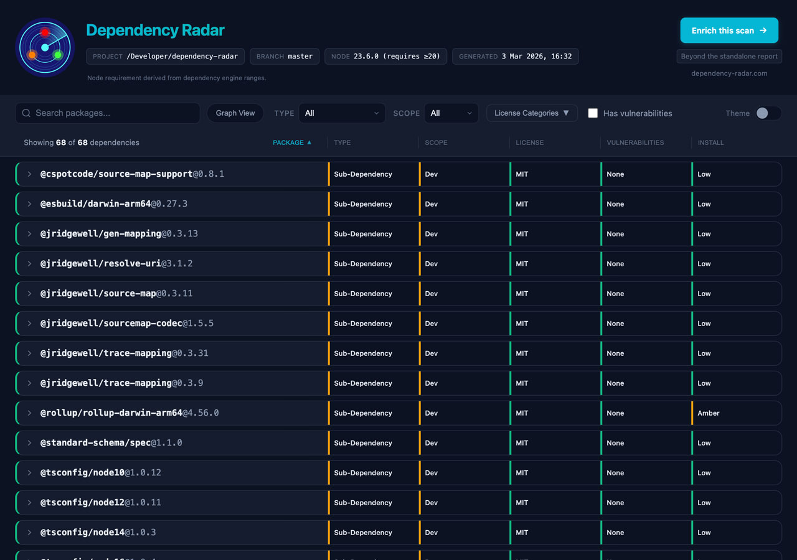
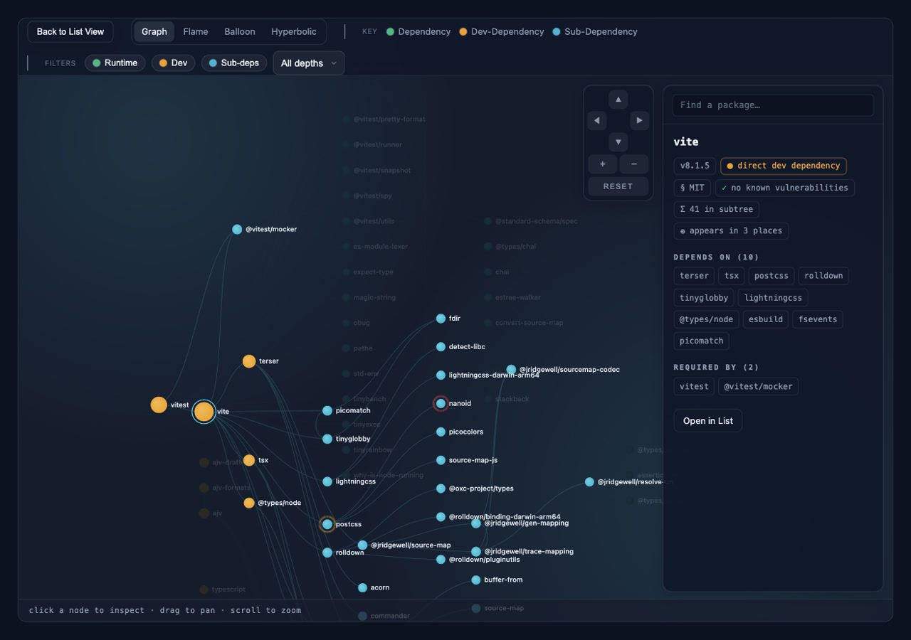

# Dependency Radar

Dependency Radar inspects your Node.js dependency graph and makes structural risk visible.

Unlike basic audit tools, it builds the graph from lockfiles, understands PNPM workspaces, validates declared vs inferred licences, and highlights structural risks before they become production problems.

No accounts. No uploads. Nothing leaves your machine.

The simplest way to get started is to go to your project root and run:

```bash
npx dependency-radar
```

This runs a scan against the current project and writes a self-contained `dependency-radar.html` report you can open locally, share with teammates, or attach to tickets and documentation.

---


*List view: search, filter, and drill into every dependency — licence, vulnerabilities, install risk, depth, origins, and more.*


*Graph view: explore the full dependency tree visually, with direct, dev, and transitive relationships at a glance.*

---

## What you get

- **Vulnerability scanning** — runs `npm audit` / `pnpm audit` / `yarn audit` and surfaces advisories with severity, fix availability, and reachability heuristics
- **License analysis** — validates SPDX declarations, infers licences from `LICENSE` files, and flags mismatches, unknown licences, and strong copyleft
- **Interactive dependency graph** — explore your full dependency tree visually, including direct, dev, and transitive relationships
- **Upgrade friction analysis** — identifies upgrade blockers: peer constraints, engine ranges, native bindings, install scripts, deprecated packages
- **Import usage heuristics** — classifies each dependency's runtime impact (`runtime`, `build`, `testing`, `tooling`, `mixed`) based on where it's imported in your source
- **Full transitive tree** — shows depth, parent relationships, fan-in/fan-out, and dependency origins
- **Workspace support** — works across npm, pnpm, and Yarn workspaces
- **CI-friendly** — `--fail-on` flag lets you enforce licence, vulnerability, and compare-mode dependency change policies in pipelines
- **Review-friendly outputs** — emit JSON, SARIF, CycloneDX SBOM, or SPDX SBOM artifacts from the same local scan
- **Change comparison** — compare a fresh scan with a previous `dependency-radar.json` to see added dependencies, removed dependencies, version changes, and new findings
- **Source review signals** — flags git, local file, and non-registry tarball dependency sources
- **Lockfile integrity signals** — flags missing integrity data and unexpected registry hosts
- **Local execution review signals** — flags install-time behavior and bounded local execution capability signals
- **Packaging and registry review signals** — flags packaging cues, optional npm signature/provenance results, and limited registry-metadata heuristics applied only to packages already flagged as suspicious
- **Offline-capable** — use `--offline` to skip registry calls; dependency metadata is still read from local `node_modules`
- **Single self-contained HTML file** — no server needed; open it locally, attach it to a ticket, or share it with your team

## When should you use this?

- Before a release that requires licence review or compliance sign-off
- When assessing an unfamiliar codebase (for example during onboarding or due diligence before an acquisition)
- When evaluating a new framework or major dependency
- When you want CI guardrails via `--fail-on`
- When you need a portable HTML artifact for review, audit, or stakeholder discussion

## What it is not

- Not a CI service or hosted scanning platform
- Not a replacement for dedicated security scanners
- Not a bundler or build tool
- Not a dependency updater

## Why this exists

Modern Node projects pull in hundreds (or thousands) of transitive dependencies, and most of the risk is structural, not obvious.

- `npm audit` tells you about known vulnerabilities, but it does not explain how a dependency got there, whether it is reachable at runtime, or how deep it sits in your graph.
- License tooling often trusts `package.json` declarations, even though they can be missing, invalid, or wrong, and rarely checks what is actually in the installed `LICENSE` file.
- Monorepos and PNPM workspaces make the tree harder to reason about, especially when package manager outputs include optional platform variants that are not installed on your machine.
- Upgrade pain usually shows up late, when a Node major bump or a package update breaks due to peer dependency constraints, engine ranges, native bindings, or install scripts.

Dependency Radar exists to make those hidden signals visible in one place, from the dependencies you actually have installed, with a single report you can review, share, and use to set practical CI guardrails.

---

## Need to share findings with leadership?

The CLI tool is free and fully functional forever.

If you need to communicate dependency risk beyond engineering (CTO, compliance, security, clients, or investors), the optional premium service adds executive summaries, presentation-ready reports, and deeper enrichment signals that are not available in the standard local scan.

These include ecosystem and maintenance insights such as whether a dependency is archived, deprecated upstream, actively maintained, or showing signs of stagnation, helping you prioritise risk in larger portfolios or during technical due diligence.

See https://dependency-radar.com for details.

---

## Usage

Run a scan against the current project (writes `dependency-radar.html`):

```bash
npx dependency-radar
```

The `scan` command is the default and can also be run explicitly as `npx dependency-radar scan`.

**Options:**

| Flag | Description |
|---|---|
| `--project <path>` | Path to the project to scan (defaults to current directory) |
| `--quiet` | Suppress progress/info logs, browser opening, and footer messaging while keeping the final summary and failures visible |
| `--out <path>` | Output path for the report file |
| `--format <format>` | Output format: `html`, `json`, `sarif`, `cyclonedx`, or `spdx` |
| `--sbom <format>` | Convenience alias for SBOM output: `cyclonedx` or `spdx` |
| `--target-node <major>` | Add Node major compatibility findings based on local `engines.node` metadata |
| `--audit-signatures` | Run `npm audit signatures` for registry signature/provenance verification (opt-in; skipped with `--offline`) |
| `--schema` | Print the current Dependency Radar JSON schema, or write it with `--out <path>` |
| `--offline` | Skip registry lookups: `npm audit`, `npm outdated`, signature checks, and targeted registry enrichment |
| `--json` | Output JSON instead of HTML (`dependency-radar.json`) |
| `--timestamp` | Add a local timestamp to generated report filenames (`dependency-radar.YYYY-MM-DD_HH-mm-ss.html`) |
| `--no-report` | Run analysis only; no HTML/JSON output written |
| `--keep-temp` | Keep the temporary `.dependency-radar/` folder for debugging |
| `--open` | Open the generated report using the system default browser |
| `--fail-on <rules>` | Fail with exit code 1 when selected policy rules are violated (see below) |
| `--help` | Show all options |

### Explain one dependency in the terminal

Use `explain` when you want a fast terminal view for one package without generating HTML or JSON output:

```bash
npx dependency-radar explain lodash
```

This reuses the normal scan model and then filters it in memory. `explain` does not add its own extra lookup pipeline and does not write `dependency-radar.html`, but it can still trigger the same network-dependent `audit` and `outdated` steps as a normal scan unless you pass `--offline`.

`explain` shows the signals already present in Dependency Radar's scan model, including:

- direct vs transitive
- scope and introduction classification
- runtime impact heuristics
- root packages and direct parents
- static import evidence and top import locations
- vulnerability summary when audit data is available
- licence status
- upgrade blockers
- other detected versions of the same package

Examples:

```bash
npx dependency-radar explain lodash
```

```bash
npx dependency-radar explain lodash --project ./my-app
```

```bash
npx dependency-radar explain lodash --project ./my-app --offline
```

Notes:

- `explain` matches by package name only. If multiple installed versions exist, each version is shown in its own block.
- Vulnerabilities are reported only when audit data is available. With `--offline`, the command prints `not available (--offline)` instead of implying `none`.
- "Static import evidence" means Dependency Radar found local source imports for that package. It is a code-usage heuristic, not exploit reachability analysis.
- "Introduced via root packages" and "Direct parents" are shown from the current scan model. The command does not currently print full ancestry chains.

### Show why a dependency is present

Use `why` to print shortest dependency paths from direct dependencies to a package:

```bash
npx dependency-radar why lodash
```

This uses the same local scan model as the HTML report. When full paths are unavailable, it falls back to the package origins and direct parent evidence available in the report model.

### Compare against a previous report

Use `compare` to scan the current project and compare it with an earlier JSON report:

```bash
npx dependency-radar compare ./dependency-radar-before.json --json --offline
```

The comparison highlights added dependencies, removed dependencies, one-version package changes, new findings, and resolved findings. This is useful in pull requests and release checks.

Compare mode can also fail CI when a dependency change introduces a new risky trait compared with a committed JSON baseline:

```bash
npx dependency-radar compare ./dependency-radar-baseline.json --offline --fail-on new-supply-chain-signal,new-install-script,new-child-process
```

This is intentionally not a generic "any dependency changed" gate. It is a review guardrail for targeted local signals such as a newly introduced install script, native build surface, CLI executable, direct dependency, local execution capability signal, packaging signal, or lockfile supply-chain source signal. These signals mean "review this change"; they are not malware verdicts.

Local execution capability signals are derived by bounded static inspection of lifecycle script commands, referenced install files, package `bin` targets, entry files, and a small capped subset of text-like package source files. Dependency Radar currently reports signals such as child process APIs, network access references, environment access, home directory access, SSH-related references, and obfuscation-like code shape. Scanning is capped by file count and bytes per file so large packages do not become expensive to inspect.

Packaging signals are local metadata/content cues such as declared bundled dependencies or an embedded `npm-shrinkwrap.json`. They are review aids for unusual packaging patterns, not proof of compromise.

### Targeted registry enrichment for suspicious packages

Dependency Radar can perform a small number of targeted npm registry metadata lookups for packages that already show local review signals, such as install hooks, native bindings, executable bins, supply-chain source signals, or suspicious execution/packaging signals.

This enrichment is bounded and selective:
- it does not query every dependency
- it is capped to 10 suspicious package names per scan
- it is skipped when `--offline` is used

When metadata is available, Dependency Radar may derive additional review signals such as:
- recently published package
- recently published installed version
- low release history
- package reactivated after a long dormant period
- recent patch activity on an older major version line

These are heuristic review signals, not proof that a package is malicious or compromised.

These signals can appear in the report, JSON output, compare mode, and CI fail rules when supported by the current scan and baseline data.

### CI policy enforcement (`--fail-on`)

```
npx dependency-radar --fail-on reachable-vuln,licence-mismatch
```

Supported rules:

| Rule | Description |
|---|---|
| `reachable-vuln` | Fail if at least one reachable runtime vulnerability is present |
| `production-vuln` | Fail if at least one runtime vulnerability is present (reachability ignored) |
| `high-severity-vuln` | Fail if at least one high/critical vulnerability is present |
| `licence-mismatch` | Fail if at least one dependency has a declared-vs-inferred licence mismatch |
| `copyleft-detected` | Fail if strong copyleft (GPL/AGPL) appears in runtime dependencies |
| `unknown-licence` | Fail if at least one dependency has neither declared nor inferred licence data |
| `supply-chain-source` | Fail if lockfile source signals detect git/local/tarball sources, missing integrity, or unexpected registry hosts |

The following rules are evaluated only by `compare <previous dependency-radar.json>` and use the previous JSON report as the baseline:

| Rule | Description |
|---|---|
| `new-supply-chain-signal` | Fail if the current scan has a lockfile supply-chain signal that was not present in the baseline for the same package, or was not present at all when the signal is not package-specific |
| `new-install-script` | Fail if a dependency now exposes install lifecycle hooks and the baseline did not show install hooks for that package |
| `new-native-binding` | Fail if a dependency now exposes native build or binary surface and the baseline did not show native surface for that package |
| `new-bin` | Fail if a dependency now declares a package `bin` executable and the baseline did not show a `bin` for that package |
| `new-direct-dependency` | Fail if a package is now direct and was not direct in the baseline |
| `new-child-process` | Fail if a dependency newly shows local child process API usage |
| `new-network-access` | Fail if a dependency newly shows local network access references |
| `new-env-access` | Fail if a dependency newly shows local environment variable access |
| `new-home-access` | Fail if a dependency newly shows local home directory access |
| `new-ssh-usage` | Fail if a dependency newly shows SSH-related path, command, or environment references |
| `new-obfuscation-signal` | Fail if a dependency newly shows an obfuscation-like local code shape |
| `new-bundled-dependencies` | Fail if a dependency newly declares bundled dependencies |
| `new-shrinkwrap` | Fail if a dependency newly contains an embedded `npm-shrinkwrap.json` |
| `new-recent-package` | Fail if a dependency newly shows the `recent-package` registry review signal |
| `new-recent-version` | Fail if a dependency newly shows the `recent-version` registry review signal |
| `new-low-release-history` | Fail if a dependency newly shows the `low-release-history` registry review signal |
| `new-reactivated-package` | Fail if a dependency newly shows the `reactivated-package` registry review signal |
| `new-old-major-patch` | Fail if a dependency newly shows the `old-major-new-patch` registry review signal |

When rules are violated, Dependency Radar prints `✖ Policy violations detected:` and exits `1`. Unknown rules also exit `1` with a clear error message.

For compare-mode delta rules, the failure output includes the package and the specific change, for example:

```text
- 1 new install script surface
  - lodash@4.17.21 introduced install hooks: postinstall
- 1 new execution signal: child-process
  - foo@1.2.3 introduced execution signal: child-process
- 1 new registry risk signal: recent-version
  - bar@4.5.6 introduced registry risk signal: recent-version
```

To use this in CI, commit a known-good JSON report, regenerate it intentionally when reviewed dependency changes are accepted, and compare pull requests against that file.

### Example: open the generated report using the system default:

```bash
npx dependency-radar --open
```

### Example: specify project and output path

```
npx dependency-radar --project ./my-app --out ./reports/dependency-radar.html
```

### Example: write SARIF for CI/code scanning

```bash
npx dependency-radar --format sarif --out ./reports/dependency-radar.sarif
```

### Example: write an SBOM

```bash
npx dependency-radar --sbom cyclonedx --out ./reports/bom.cdx.json
```

```bash
npx dependency-radar --sbom spdx --out ./reports/bom.spdx.json
```

### Example: check Node upgrade readiness signals

```bash
npx dependency-radar --target-node 22
```

### Example: verify npm registry signatures/provenance

```bash
npx dependency-radar --audit-signatures
```

This runs `npm audit signatures` as an opt-in online check. It is skipped when `--offline` is used.

### Example: write the JSON schema

```bash
npx dependency-radar --schema --out ./reports/dependency-radar.schema.json
```

### Example: keep temp files for debugging
```bash
npx dependency-radar --keep-temp
```

### Example: skip `npm audit` and `npm outdated` (useful for offline scans):

```bash
npx dependency-radar --offline
```

### Example: don't create report and fail the command in CI when selected policy rules are violated:

```bash
npx dependency-radar --no-report --fail-on reachable-vuln,licence-mismatch
```

### Example: quiet mode for CI or scripting

```bash
npx dependency-radar scan --quiet --no-report
```

`--quiet` is quiet, not silent:

- the scan still runs fully
- reports are still generated unless `--no-report` is set
- the final summary block is still printed
- policy failures are still printed
- progress/info logs, automatic browser opening, and the promotional footer are suppressed

__Note:__ When used with `--no-report`, the `--keep-temp` flag is ignored. 
Temporary files are normally deleted automatically. 
If you intentionally use `--keep-temp` (without `--no-report`) for debugging, 
the `.dependency-radar/` folder may contain dependency metadata and should not be committed.

### CLI summary

At the end of each scan, the CLI prints a summary block with high-level counts, for example:

```text
Summary:
• Direct dependencies scanned: 6
• Transitive dependencies scanned: 62
• Vulnerable packages: 1 (0 reachable)
• Dependencies with no static import reference: 0
• License mismatches: 3
• Major upgrade blockers: 24
   - 1 strict peer dependency constraint
   - 22 narrow engine ranges
   - 2 native bindings
   - 1 install lifecycle script
```

The blocker detail counts can overlap: a single package may contribute to multiple blocker categories.


## Package Manager Support

| Package Manager | Dependency Tree | Audit | Outdated | Workspaces |
|---|---|---|---|---|
| npm | ✅ Lockfile-first (`package-lock.json` / `npm-shrinkwrap.json`) | ✅ | ✅ | ✅ |
| pnpm | ✅ Lockfile-first (`pnpm-lock.yaml`) | ✅ | ✅ | ✅ |
| Yarn Classic (v1) | ✅ Lockfile-first (`yarn.lock`) | ✅ | ✅ | ✅ |
| Yarn Berry (v2+, node-modules linker) | ✅ Lockfile-first (`yarn.lock`) | ✅ | ⚠️ Plugin-dependent | ✅ |
| Yarn Plug'n'Play | ⚠️ Lockfile-derived graph only; package metadata may be incomplete without `node_modules` | ✅ | ⚠️ Plugin-dependent | ✅ |
| Bun | ⚠️ Text `bun.lock` parsing; binary `bun.lockb` is reported with a migration hint | N/A | ❌ | ⚠️ package.json workspaces only |

## Requirements

- Node.js 14.21.3 is currently the oldest version verified by our Docker release smoke test (`node:14.21.3-bullseye`)
- Dependencies must be installed (`npm install` / `pnpm install` / `yarn install`) before scanning

## How a scan works

When you run `npx dependency-radar` (or `dependency-radar scan`), the CLI executes this pipeline:

1. Parse CLI options (`--project`, `--out`, `--offline`, `--json`, `--timestamp`, `--no-report`, `--keep-temp`, `--open`, `--fail-on`, `--audit-signatures`, `--schema`).
2. Detect workspace/package-manager context:
   - Workspace roots from `pnpm-workspace.yaml` or `package.json#workspaces`
   - Dependency policy from `package.json` and `pnpm-workspace.yaml` overrides/resolutions
   - Package manager from `packageManager`, lockfiles, and installed metadata
   - Yarn Plug'n'Play detection (`.pnp.cjs`/`.pnp.js` or `.yarnrc.yml nodeLinker: pnp`)
   - Bun text lockfile detection (`bun.lock`; binary `bun.lockb` is not parsed)
3. Create a temporary `.dependency-radar/` directory inside the scanned project.
4. For each workspace package (or just the project root in single-package mode), collect dependency graph data:
   - Lockfile-first graph parsing (`pnpm-lock.yaml`, `npm-shrinkwrap.json`/`package-lock.json`, `yarn.lock`)
   - Fallback to package-manager tree commands (`npm ls` / `pnpm list` / `yarn list`) only when lockfile parsing is unavailable
   - PNPM CLI fallback retries with reduced depth for very large trees
5. Run additional collectors:
   - Vulnerabilities (`npm audit` / `pnpm audit` / `yarn audit` or `yarn npm audit`)
   - Version drift (`npm outdated` / `pnpm outdated` / `yarn outdated`, where available)
   - Source import graph (static import/require parsing in `src/` or project root)
   - Lockfile supply-chain source signals
   - Optional npm registry signature/provenance verification (`--audit-signatures`)
   - Targeted npm registry metadata for up to 10 packages that already show local or supply-chain review signals (skipped with `--offline`)
6. Normalize outputs into one internal shape and merge workspace package results.
   - PNPM lock/CLI dependency trees are filtered to installed-only packages (non-installed optional/platform variants are dropped)
7. Resolve and crawl installed package directories in `node_modules` to collect local metadata:
   - Resolve `package.json` paths via package-manager-aware lookups (including PNPM virtual store layouts)
   - Read local package metadata and license artifacts from installed files
8. Aggregate dependency records by enriching each installed package with:
   - License declaration + `LICENSE` file inference/validation
   - Advisory summaries and severity/risk rollups
   - Root-cause/origin and runtime-impact heuristics
   - Install-time execution signals, local execution capability signals, packaging signals, and targeted registry metadata review signals
   - Local package metadata (`description`, links, deprecation, TypeScript type availability, installed file count, CLI `bin` presence)
9. Build normalized findings from the aggregated dependency model:
   - Vulnerabilities, license review items, install-time execution surface, local execution capability signals, packaging signals, targeted registry metadata review signals, native bindings, deprecated packages, target Node compatibility findings, lockfile source signals, and npm signature/provenance failures
10. Write final output as one of:
   - `dependency-radar.html` (self-contained report), or
   - `dependency-radar.json` (raw aggregated model)
   - SARIF (`--format sarif`)
   - CycloneDX SBOM (`--format cyclonedx` / `--sbom cyclonedx`)
   - SPDX SBOM (`--format spdx` / `--sbom spdx`)
11. Remove `.dependency-radar/` unless `--keep-temp` is set.

The scan is local-first: package metadata is read from `node_modules`. Audit/outdated commands, optional signature checks, and targeted registry enrichment require registry access and are skipped or disabled with `--offline`.

The `explain` command reuses this same pipeline with report writing disabled, then filters the in-memory model down to a single package for terminal output.

### `node_modules` crawling details

- Dependency metadata is read from installed package directories. Targeted registry enrichment reads only npm metadata for a capped set of already suspicious packages during online scans.
- Package resolution is workspace-aware and PNPM-aware, including `.pnpm` virtual store paths.
- License discovery checks common file variants such as `LICENSE`, `LICENCE`, `COPYING`, and `NOTICE` (with or without extensions like `.md`).

### Lockfile-first dependency graphing

- Dependency graph construction starts from lockfiles so deep transitive packages are captured without relying on large `* ls` JSON payloads.
- Lockfile detection is scoped to the scan root/workspace root (it does not walk outside the scanned project).
- If lockfile parsing cannot be used, Dependency Radar falls back to package-manager tree commands and continues with warnings when partial failures occur.

### PNPM workspace hardening (problems solved)

- In real PNPM workspaces, `pnpm list --json` can include optional platform dependencies that are not installed on the current machine (for example `@esbuild/linux-*` on macOS ARM64).
- Dependency Radar verifies PNPM entries against installed artifacts (`node_modules/.pnpm` and workspace-linked `node_modules` paths) before including them in the report.
- Dependency Radar uses `pnpm-lock.yaml` as the primary graph source and only falls back to `pnpm list` when needed, reducing OOM/string-length failures on large workspaces.
- Result: reports now reflect only dependencies that actually exist on disk and can be inspected locally.

### Usage Heuristics (`usage.runtimeImpact` and `usage.introduction`)

These two fields are inferred from local signals. They are intended as review hints, not strict truth.

### `usage.runtimeImpact`

`runtimeImpact` is inferred from the import graph and file-path classification:

1. Dependency imports are collected from source files (`import`, `export ... from`, `require()`, and static `import()`).
2. Each importing file is classified into one of: `runtime`, `build`, `testing`, `tooling`.
3. Classification is path-pattern based (examples):
   - `testing`: `__tests__`, `test`, `tests`, `e2e`, `cypress`, `playwright`, `*.test.*`, `*.spec.*`
   - `tooling`: eslint/prettier/stylelint/commitlint/lint-staged/husky/renovate/release configs
   - `build`: webpack/rollup/vite/tsconfig/babel/swc/esbuild/parcel/postcss/tailwind/storybook/turbo/nx configs and common `scripts/build*` paths
4. Per dependency, category weights are summed from import counts.
5. Result selection:
   - Single dominant category => that category
   - Strong majority (for example >= 70%) => that category
   - Otherwise => `mixed`

### `usage.introduction`

`introduction` is inferred from dependency graph roots, scope, and runtime impact:

1. If dependency is direct => `direct`
2. If `runtimeImpact` is `testing` => `testing`
3. If `runtimeImpact` is `tooling` or `build` => `tooling`
4. If inferred scope is `dev` => `tooling`
5. If inferred scope is `peer` and `runtimeImpact` is not `runtime` => `tooling`
6. If all root-cause direct dependencies are in a tooling allowlist => `tooling`
7. If any root-cause direct dependency is in a framework allowlist => `framework`
8. If root causes exist but none of the above match => `transitive`
9. Otherwise => `unknown`

### Validity and limits

- Valid as directional metadata for prioritization and triage.
- Not valid as a definitive runtime/ownership model.
- Accuracy depends on file naming conventions, static import detectability, and dependency graph quality from package manager output.

### Upgrade Blockers Heuristic (`upgrade.blockers`, `upgrade.blocksNodeMajor`)

`upgrade.blockers` is a local, static heuristic for upgrade friction. It does not run package code and does not query external APIs.

### How blockers are collected

For each installed dependency, Dependency Radar inspects local package metadata and install-surface signals and may add one or more blockers:

- `nodeEngine`: Added when `package.json#engines.node` looks restrictive (for example `>=16`, `^18`, `<20`, ranges with concrete major constraints). Permissive forms such as `*` and `>=0` are not flagged.
- `peerDependency`: Added when the package declares at least one non-optional peer dependency (`peerDependencies`, excluding peers marked `peerDependenciesMeta.<name>.optional: true`).
- `nativeBindings`: Added when native build/binary surface is detected (`binding.gyp`, `.node` binaries, or native build tooling in scripts such as `node-gyp`/`prebuild`).
- `installScripts`: Added when install lifecycle hooks are present (`preinstall`, `install`, or `postinstall`).
- `deprecated`: Added when the package is marked deprecated in installed metadata.

### `blocksNodeMajor` meaning

`upgrade.blocksNodeMajor` is only emitted when local signals suggest Node major upgrades may be risky for that package. It is set from a subset of blockers:

- `nodeEngine`
- `nativeBindings`
- `installScripts`

It is not set from `peerDependency` or `deprecated` alone.

### Accuracy and limits

- High signal: `nativeBindings`, `deprecated`, and non-optional `peerDependency` are generally reliable local indicators.
- Medium signal: `nodeEngine` is heuristic range parsing; unusual semver expressions may be under- or over-classified.
- Medium signal: `installScripts` indicates lifecycle execution surface, not guaranteed breakage.
- The field represents friction likelihood, not a guaranteed upgrade failure.
- Future versions may expand blocker categories; consumers should handle unknown blocker strings defensively.

## License Scanning

Dependency Radar validates SPDX licenses declared in `package.json` and can infer licenses from `LICENSE` files when declarations are missing or invalid. It works offline and uses a bundled SPDX identifier list (generated at build time) with no runtime network access. Each dependency gets a structured license record with:

- Declared SPDX validation (including deprecated IDs and `WITH` exceptions)
- Inferred SPDX license (with confidence: `high`, `medium`, `low`) based on deterministic text matching
- A status (`declared-only`, `inferred-only`, `match`, `mismatch`, `invalid-spdx`, `unknown`) to make review decisions easier

This logic applies to all dependencies (direct and transitive). Inferred licenses are never treated as authoritative over valid declared SPDX expressions.

`licenseRisk` is derived from SPDX IDs, with one escalation rule for safety: when status is `mismatch` (declared SPDX differs from inferred LICENSE text), risk is promoted to at least `amber`.
In the HTML report, the License badge shows a trailing `*` when status is `mismatch`.
When a dependency repository resolves to GitHub, the expanded License section links to `package.json` and `LICENSE` source files for faster verification.

## JSON output

Use `--json` to write the aggregated scan data as JSON (defaults to `dependency-radar.json`).

The JSON schema matches the `AggregatedData` TypeScript interface in `src/types.ts`. For quick reference:

```ts
export interface AggregatedData {
  schemaVersion: '1.4'; // Report schema version for compatibility checks
  generatedAt: string; // ISO timestamp when the scan finished
  dependencyRadarVersion: string; // CLI version that produced the report
  git: {
    branch: string; // Git branch name, empty when unavailable/detached
  };
  project: {
    projectDir: string; // Project path relative to the user's home directory (e.g. /Developer/app)
    name?: string; // package.json#name from the scanned project root
    version?: string; // package.json#version from the scanned project root
    description?: string; // package.json#description
    license?: string; // package.json#license
    keywords?: string[]; // package.json#keywords
    homepage?: string; // package.json#homepage
    repository?: string; // repository URL (string or repository.url)
    constraints?: {
      os?: string[]; // package.json#os constraints
      cpu?: string[]; // package.json#cpu constraints
      enginesNode?: string; // package.json#engines.node
    };
    dependencyPolicy?: {
      overrides?: Record<string, unknown>; // package.json overrides plus pnpm workspace overrides
      resolutions?: Record<string, unknown>; // package.json#resolutions
    };
    dependencyPolicySummary?: {
      hasOverrides: boolean;
      overrideCount: number; // Top-level override entries
      overriddenPackageNames?: string[]; // Package names parsed from override selectors
      hasResolutions: boolean;
      resolutionCount: number; // Top-level resolution entries
      resolvedPackageNames?: string[]; // Package names parsed from resolution selectors
      sources?: string[]; // Where policy came from (e.g. package.json#overrides, pnpm-workspace.yaml#overrides)
    };
  };
  environment: {
    nodeVersion: string; // Node.js version from process.versions.node
    runtimeVersion: string; // Node.js runtime version from process.version
    minRequiredMajor: number; // Strictest Node major required by dependency engines (0 if unknown)
    targetNodeMajor?: number; // Node major passed through --target-node
    platform?: string; // OS platform (process.platform)
    arch?: string; // CPU architecture (process.arch)
    ci?: boolean; // True when CI indicators are detected
    packageManagerField?: string; // package.json packageManager field (e.g. pnpm@9.1.0)
    packageManager?: 'npm' | 'pnpm' | 'yarn' | 'bun'; // Package manager used for dependency/audit/outdated collection
    packageManagerVersion?: string; // Version of the selected package manager (when available)
    toolVersions?: {
      npm?: string;
      pnpm?: string;
      yarn?: string;
    };
  };
  workspaces: {
    enabled: boolean; // True when the scan used workspace aggregation
    type?: 'npm' | 'pnpm' | 'yarn' | 'bun' | 'none'; // Workspace mode (CLI currently always emits this)
    packageCount?: number; // Number of workspace packages scanned (CLI currently always emits this)
    workspacePackages?: WorkspacePackage[]; // Lightweight first-party workspace metadata
  };
  summary: {
    dependencyCount: number; // Total EXTERNAL dependencies in the graph
    directCount: number; // External dependencies listed in package.json
    transitiveCount: number; // External dependencies pulled in by other dependencies
    findingCount?: number; // Number of normalized findings generated from the dependency model
  };
  supplyChain?: {
    signals: Array<{
      type:
        | 'git-dependency'
        | 'file-dependency'
        | 'non-registry-tarball'
        | 'missing-integrity'
        | 'unexpected-registry-host'
        | 'signature-verification-failed'
        | 'signature-verification-unavailable';
      packageName?: string;
      packageVersion?: string;
      packageId?: string;
      source: string;
      detail: string;
    }>;
    signatureAudit?: {
      attempted: boolean;
      ok: boolean;
      output?: string;
      error?: string;
    };
  };
  findings?: DependencyFinding[]; // Normalized review/CI findings
  dependencies: Record<string, DependencyRecord>; // External third-party packages keyed by name@version
}

export interface WorkspacePackage {
  name: string; // Workspace package name from package.json
  relativePath: string; // Workspace-relative path (e.g. apps/web)
  directExternal: {
    runtime: number; // Unique direct external deps from dependencies + optionalDependencies
    dev: number; // Unique direct external deps from devDependencies
  };
}

export interface DependencyRecord {
  package: {
    id: string; // Stable identifier in the form name@version
    name: string; // Package name from npm metadata
    version: string; // Installed version from npm ls
    description?: string; // Description from the installed package.json (if present)
    fileCount?: number; // Number of files in the installed package folder (excluding nested node_modules)
    hasBin?: true; // True if package.json declares at least one executable in `bin`
    deprecated: boolean; // True if the package.json has a deprecated flag
    links: {
      npm: string; // npm package page URL
      repository?: string; // Repository URL (if present)
      homepage?: string; // Homepage URL (if present)
      bugs?: string; // Issue tracker URL (if present)
    };
  };
  compliance: {
    license: {
      declared?: {
        spdxId: string; // SPDX ID or expression from package.json
        expression: boolean; // True when SPDX expression (AND/OR/WITH)
        deprecated: boolean; // True if SPDX ID is deprecated
        valid: boolean; // True if SPDX ID/expression is valid
      };
      inferred?: {
        spdxId: string; // SPDX ID inferred from LICENSE text
        confidence: 'high' | 'medium' | 'low'; // Heuristic confidence
      };
      exception?: {
        id: string; // SPDX exception id
        deprecated: boolean; // True if exception is deprecated
        valid: boolean; // True if exception id is valid
      };
      status:
        | 'declared-only'
        | 'inferred-only'
        | 'match'
        | 'mismatch'
        | 'invalid-spdx'
        | 'unknown';
    };
    licenseRisk: 'green' | 'amber' | 'red'; // Risk classification derived from declared/inferred SPDX ids (mismatch is escalated to at least amber)
  };
  security: {
    summary: {
      critical: number; // npm audit counts for critical issues
      high: number; // npm audit counts for high issues
      moderate: number; // npm audit counts for moderate issues
      low: number; // npm audit counts for low issues
      highest: 'low' | 'moderate' | 'high' | 'critical' | 'none'; // Highest severity present
      risk: 'green' | 'amber' | 'red'; // Risk classification derived from audit counts
    };
    advisories?: Array<{
      id: string; // Advisory identifier (GHSA, npm advisory ID, or source-specific fallback)
      title: string; // Human-readable advisory title
      severity: 'low' | 'moderate' | 'high' | 'critical';
      vulnerableRange: string; // Semver range
      fixAvailable: boolean; // True if npm audit indicates a fix exists
      url: string; // Advisory URL (may be empty when unavailable)
    }>;
  };
  upgrade: {
    nodeEngine: string | null; // engines.node from the package.json (if present)
    outdatedStatus?: 'current' | 'patch' | 'minor' | 'major' | 'unknown'; // Derived from npm outdated (field is omitted rather than set to 'current')
    latestVersion?: string; // Latest version from outdated data (present for patch/minor/major when known)
    blockers?: Array<'nodeEngine' | 'peerDependency' | 'nativeBindings' | 'installScripts' | 'deprecated'>; // Reasons for upgrade friction
    blocksNodeMajor?: boolean; // Present when local signals indicate a Node major bump is risky
  };
  usage: {
    direct: boolean; // True if declared in package.json (dependencies/devDependencies/etc.)
    scope: 'runtime' | 'dev' | 'optional' | 'peer'; // Scope inferred from the declaring root package(s)
    depth: number; // Minimum dependency tree depth observed in npm ls
    origins: {
      rootPackageCount: number; // Number of direct roots that introduce this dependency
      topRootPackages: Array<{ name: string; version: string }>; // Up to 10 root packages (name/version)
      parentPackageCount: number; // Number of direct parents
      topParentPackages: string[]; // Up to 5 direct parent ids (name@version)
      workspaces?: string[]; // Workspace packages that declare/use this dependency
    };
    introduction?: 'direct' | 'tooling' | 'framework' | 'testing' | 'transitive' | 'unknown'; // Heuristic for why the dependency exists
    runtimeImpact?: 'runtime' | 'build' | 'testing' | 'tooling' | 'mixed'; // Heuristic based on import locations
    importUsage?: {
      fileCount: number; // Number of project files importing this package (import graph)
      topFiles: string[]; // Top import locations (bounded to 5)
    };
    tsTypes: 'bundled' | 'definitelyTyped' | 'none' | 'unknown'; // TypeScript type availability
  };
  graph: {
    fanIn: number; // Number of packages that depend on this package
    fanOut: number; // Number of packages this package depends on
    subDeps?: {
      // Declared outgoing dependency edges; values are tuples.
      // tuple[0] = declared version range, tuple[1] = resolved dependency id or null if not installed.
      // Only installed dependencies have full dependency records in the top-level list.
      dep?: Record<string, [string, string | null]>; // Declared runtime deps
      dev?: Record<string, [string, string | null]>; // Declared dev deps
      opt?: Record<string, [string, string | null]>; // Declared optional deps
      peer?: Record<string, [string, string | null]>; // Declared peer deps
    };
  };
  execution?: {
    risk: 'amber' | 'red'; // Install-time risk (green implied when absent)
    native?: true; // True if native bindings or build tooling are detected
    scripts?: {
      hooks: Array<'preinstall' | 'install' | 'postinstall' | 'prepare'>; // Lifecycle hooks detected
      complexity?: number; // Heuristic complexity (stored only when high)
      signals?: Array<
        | 'network-access'
        | 'dynamic-exec'
        | 'child-process'
        | 'encoding'
        | 'obfuscated'
        | 'reads-env'
        | 'reads-home'
        | 'uses-ssh'
      >; // Review-worthy install-time signals (sparse)
    };
  };
}
```

For full details and any future changes, see `src/types.ts`.

## Notes

- The target project must have dependencies installed (run `npm install`, `pnpm install`, or `yarn install` first).
- The scan runs on your machine and does not upload your code or dependencies anywhere.
- `npm audit`, `pnpm audit`, `yarn npm audit`, corresponding `outdated` commands, optional npm signature checks, and targeted registry enrichment perform registry lookups; use `--offline` for offline-only scans.
- On some Yarn Berry setups, `yarn outdated` is not available; the scan continues and marks outdated data as unavailable.
- A temporary `.dependency-radar/` folder is created during the scan to store intermediate tool output.
- Use `--keep-temp` to retain this folder for debugging; otherwise it is deleted automatically.
- If some per-package tools fail (common in large workspaces), the scan continues and reports warnings; missing sections are marked unavailable where applicable.
- Environment data includes Node.js version, OS platform, CPU architecture, and package manager versions.
- No personal information, usernames, paths, or environment variables are collected.

---

## Development

### Setup

```bash
npm install
npm run build
```

### Scripts

| Script | Description |
|---|---|
| `npm run build` | Generate SPDX/report assets and compile TypeScript to `dist/` |
| `npm run dev` | Run a scan from source (`ts-node src/cli.ts scan`) |
| `npm run scan` | Run a scan from the built output (`node dist/cli.js scan`) |
| `npm run dev:report` | Run the report UI dev server |
| `npm run build:spdx` | Rebuild bundled SPDX identifiers |
| `npm run build:report-ui` | Build report UI assets |
| `npm run build:report` | Rebuild report assets used by the CLI |
| `npm run test:unit` | Run Vitest unit tests |
| `npm run test:unit:watch` | Watch mode for fast local iteration |
| `npm run test:fixtures` | Run curated fixture integration tests (mostly offline scans) |
| `npm run test:fixtures:online` | Run online fixture checks (audit/outdated regression coverage) |
| `npm run test:fixtures:all` | Run all fixture integration tests |
| `npm run test:docker:node14` | Pack the published artifact and smoke-test it in Docker on Node `14.21.3` |
| `npm run test:docker` | Alias for the Node `14.21.3` Docker compatibility smoke test |
| `npm run test:release` | Full pre-release gate (`build` + unit + fixture + Docker Node 14 smoke test + package dry run) |


Fixture orchestration lives in `/test-fixtures/package.json` with helper scripts under `/test-fixtures/scripts`.

The Docker smoke test uses the packed tarball, installs it inside `node:14.21.3-bullseye`, and runs an offline scan against `test-fixtures/license-edge-cases`. This verifies the published CLI on the oldest Node version we currently exercise in automation without requiring local Node 14 installation.

### Report UI Development

The HTML report UI is developed in a separate Vite project located in `report-ui/`. This provides a proper development environment with hot reload, TypeScript support, and sample data.

**Start the development server:**

```bash
npm run dev:report
```

This opens the report UI in your browser with sample data covering all dependency states (various licenses, vulnerability severities, usage statuses, etc.).

**Build workflow:**

1. Make changes in `report-ui/` (edit `style.css`, `main.ts`, `index.html`)
2. Run `npm run build:report` to compile and inject assets into `src/report-assets.ts`
3. Run `npm run build` to compile the full project (this runs `build:report` automatically)

**File structure:**

- `report-ui/index.html` – HTML template structure
- `report-ui/style.css` – All CSS styles
- `report-ui/main.ts` – TypeScript rendering logic
- `report-ui/sample-data.json` – Sample data for development
- `report-ui/types.ts` – Client-side TypeScript types
- `src/report-assets.ts` – Auto-generated file with bundled CSS/JS (do not edit directly)

### Contributing

Bug reports and pull requests are welcome via GitHub.

For bug reports, please include:

- the Dependency Radar version
- your package manager and version
- your Node.js version
- the command you ran
- what you expected to happen
- what actually happened
- any relevant error output

Please remove secrets, private package names, or sensitive project details before sharing logs or reports.

For pull requests, small focused changes are easiest to review. Before opening a PR, please make sure the project builds and the relevant tests pass:

```bash
npm run build
npm run test:unit
```
For larger dependency graph, package manager, report output, or supply-chain signal changes, also run the relevant fixture tests where practical.

Please do not report suspected security vulnerabilities in public issues. See SECURITY.md for private reporting guidance.

Release notes are published through GitHub Releases, which act as the project changelog.

## Releases and changelog

Dependency Radar release notes are published through GitHub Releases:

https://github.com/JosephMaynard/dependency-radar/releases

Each release summarises notable changes, fixes, and compatibility notes where relevant.
